# 🛡️ RED OS v122.0.0 — Arquitectura Técnica & Especificación Planetaria

> Documento maestro de ingeniería de software y especificación arquitectónica de **RED (Red Criptográfica Off-Grid & P2P Mesh)**. Describe en detalle la topología de 7 capas, los protocolos criptográficos híbridos post-cuánticos (ML-KEM-768), la coordinación espectral LoRa TDMA con sincronización Kuramoto y PLL de reloj Lamport, el enrutamiento geoespacial Geohash DTN, la flota de repetidores solares autónomos ESP32-S3, la capa bio-cibernética conectómica, el catálogo consolidado de 65 módulos tácticos, el gemelo digital interactivo Vivarium Biocibernético 3D y el Hábitat Digital Biocibernético In-Silico.

---

## 📋 Índice General

1. [Mapa Visual 1: Topología Global del Sistema & Conexión de 7 Capas](#1-mapa-visual-1-topología-global-del-sistema--conexión-de-7-capas)
2. [Mapa Visual 2: Flujo Criptográfico Híbrido Post-Cuántico (ML-KEM-768 + Double Ratchet)](#2-mapa-visual-2-flujo-criptográfico-híbrido-post-cuántico)
3. [Mapa Visual 3: Autenticación Soberana, Biometría TEE/WebAuthn & Protocolo Anti-Coacción](#3-mapa-visual-3-autenticación-soberana-biometría-teewebauthn--bóveda-cifrada)
4. [Mapa Visual 4: Matriz de Enrutamiento Mesh Multi-Transporte & Protocolo ACKs](#4-mapa-visual-4-matriz-de-enrutamiento-mesh-multi-transporte--protocolo-acks)
5. [Mapa Visual 5: Motor de Inteligencia Artificial Offline & Guardian Security Firewall](#5-mapa-visual-5-motor-de-inteligencia-artificial-offline--guardian-security-firewall)
6. [Mapa Visual 6: Enrutamiento Geoespacial Geohash & Poda DTN (IndexedDB v2)](#6-mapa-visual-6-enrutamiento-geoespacial-geohash--poda-dtn)
7. [Mapa Visual 7: Coordinación Espectral LoRa TDMA (Clock Skew PLL & Sincronización Kuramoto)](#7-mapa-visual-7-coordinación-espectral-lora-tdma)
8. [Mapa Visual 8: Capa Bio-Cibernética, Conectoma Neuronal & Reflejo de Fibra Gigante](#8-mapa-visual-8-capa-bio-cibernética-conectoma-neuronal--reflejo-de-fibra-gigante)
9. [Mapa Visual 9: Flota de Repetidores Solares Autónomos ESP32-S3 & Hardware SX1262](#9-mapa-visual-9-flota-de-repetidores-solares-autónomos-esp32-s3)
10. [Resumen de Componentes, Crates & Firmware del Workspace](#10-resumen-de-componentes-crates--firmware-del-workspace)
11. [Mapa Visual 10: Vivarium Biocibernético 3D & Gemelo Digital Táctico](#11-mapa-visual-10-vivarium-biocibernético-3d--gemelo-digital-táctico)
12. [Mapa Visual 11: Hábitat Digital Biocibernético In-Silico & Ecosistema Multi-Cerebro A-Life](#12-mapa-visual-11-hábitat-digital-biocibernético-in-silico--ecosistema-multi-cerebro-a-life)
13. [Mapa Visual 12: Motor de Ajedrez Táctico Autónomo In-Silico & Cognición Inter-Especies](#13-mapa-visual-12-motor-de-ajedrez-táctico-autónomo-in-silico--cognición-inter-especies)
14. [Mapa Visual 13: El Paraíso Biocibernético In-Silico & Aprendizaje Autónomo Permanente](#14-mapa-visual-13-el-paraíso-biocibernético-in-silico--aprendizaje-autónomo-permanente)

---

## 1. Mapa Visual 1: Topología Global del Sistema & Conexión de 7 Capas

El ecosistema RED v122.0.0 opera bajo una arquitectura desacoplada de 7 capas horizontales con aislamiento estricto de memoria y enlaces de comunicación IPC seguros:

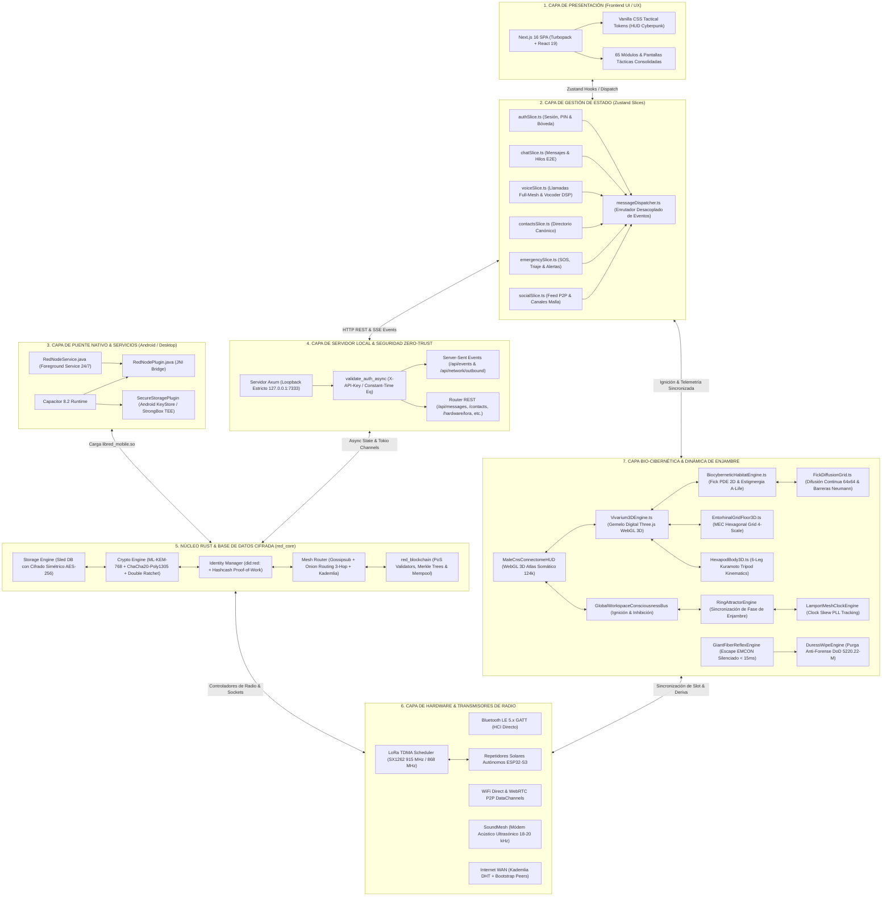

---

## 2. Mapa Visual 2: Flujo Criptográfico Híbrido Post-Cuántico

RED utiliza un esquema criptográfico de doble capa que combina criptografía de curva elíptica tradicional con algoritmos estandarizados por el NIST resistentes a computación cuántica (**FIPS 203 ML-KEM-768**):

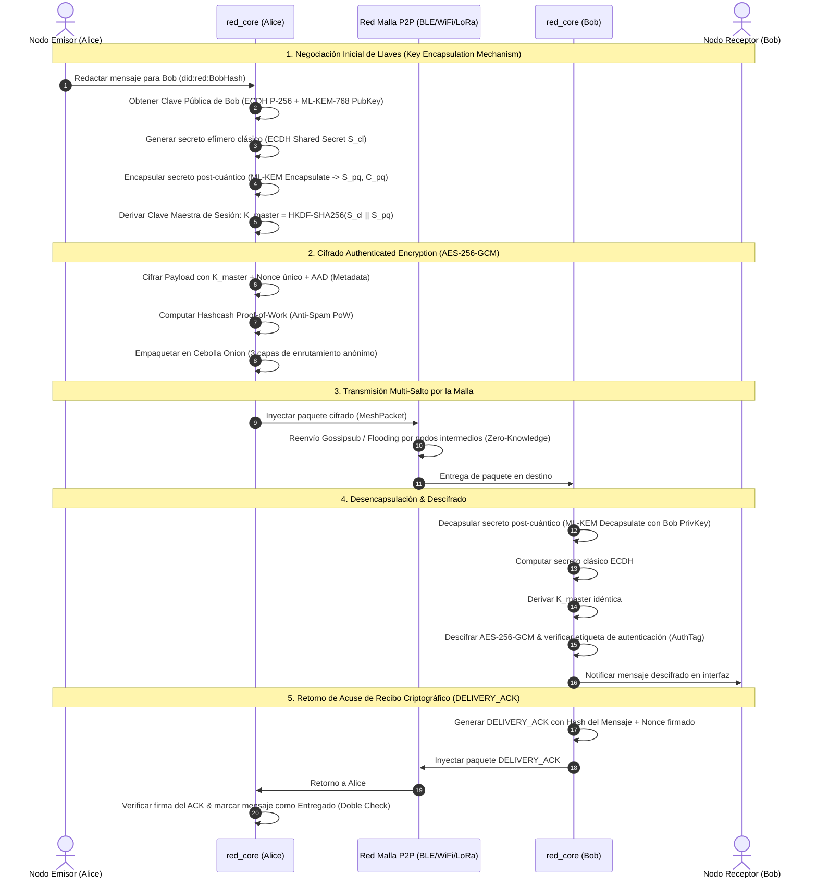

---

## 3. Mapa Visual 3: Autenticación Soberana, Biometría TEE/WebAuthn & Bóveda Cifrada

La autenticación en RED garantiza aislamiento criptográfico absoluto de la base de datos `sled`, sin contraseñas en texto plano ni puertas traseras:

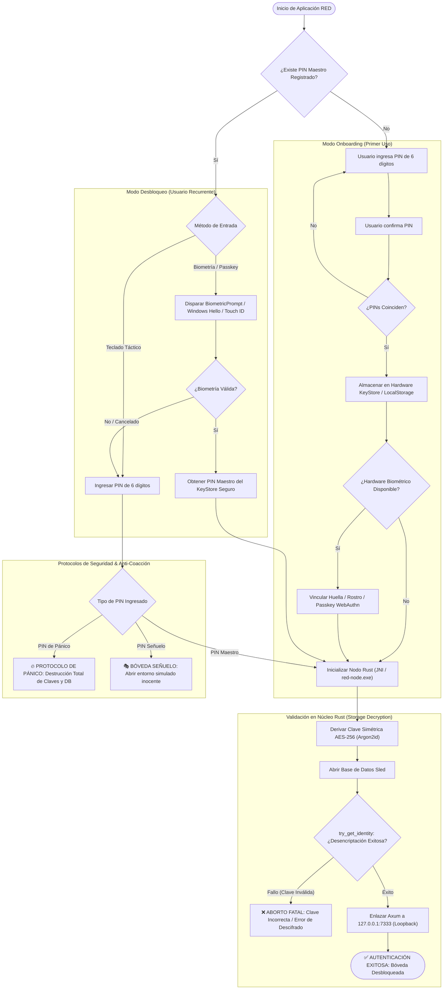

---

## 4. Mapa Visual 4: Matriz de Enrutamiento Mesh Multi-Transporte & Protocolo ACKs

RED selecciona dinámicamente el mejor medio físico de transmisión basándose en la disponibilidad de hardware, la proximidad del par y las métricas de enlace LQS (*Link Quality Score*):

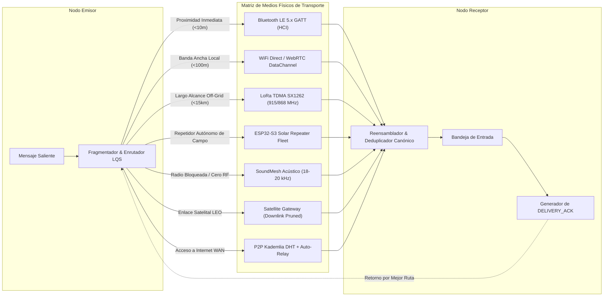

---

## 5. Mapa Visual 5: Motor de Inteligencia Artificial Offline & Guardian Security Firewall

RED integra un modelo de lenguaje neuronal y un sistema de seguridad semántica 100% offline que se ejecuta localmente en el dispositivo mediante WebAssembly y aceleración SIMD:

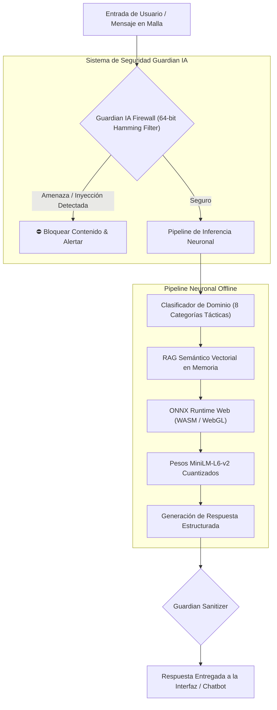

---

## 6. Mapa Visual 6: Enrutamiento Geoespacial Geohash & Poda DTN

Para evitar que mulas de datos móviles y satélites LEO colapsen sus memorias transportando tráfico global irrelevante, RED implementa el enrutamiento geoespacial por cuadrantes Geohash:

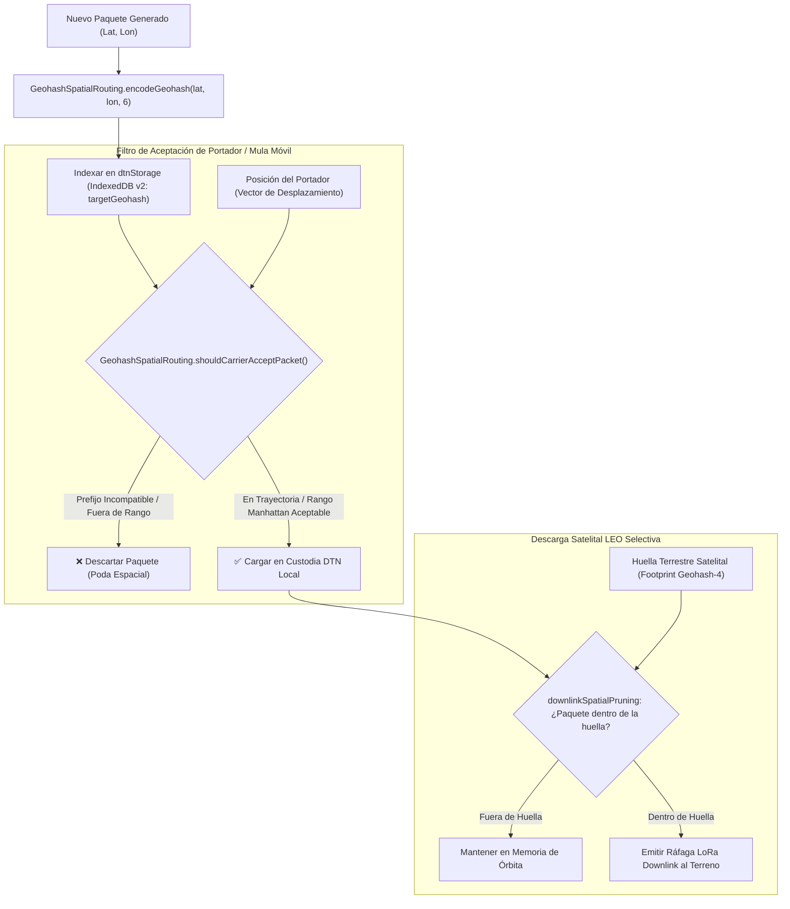

---

## 7. Mapa Visual 7: Coordinación Espectral LoRa TDMA (Clock Skew PLL & Sincronización Kuramoto)

El planificador `LoRaTdmaSchedulerEngine` y el sintetizador `LamportMeshClockEngine` organizan el espectro sub-GHz en supertramas periódicas de 2000 ms divididas en 10 slots de 200 ms, eliminando colisiones en concentraciones masivas de operadores mediante bucles de enganche de fase (PLL) y tiempos de guarda adaptativos:

```mermaid
gantt
    title Supertrama LoRa TDMA RED (2000 ms = 10 Slots de 200 ms)
    dateFormat X
    axisFormat %s ms

    section Nodos Fijos
    Slot 0 (FNV-1a Hash % 8)     :0, 200
    Slot 1 (FNV-1a Hash % 8)     :200, 400
    Slot 2 (FNV-1a Hash % 8)     :400, 600
    Slot 3 (FNV-1a Hash % 8)     :600, 800
    Slot 4 (FNV-1a Hash % 8)     :800, 1000
    Slot 5 (FNV-1a Hash % 8)     :1000, 1200
    Slot 6 (FNV-1a Hash % 8)     :1200, 1400
    Slot 7 (FNV-1a Hash % 8)     :1400, 1600

    section Sincronización
    Slot 8 (Baliza / Kuramoto / PLL) :1600, 1800

    section Contienda
    Slot 9 (CSMA/CA Backoff)    :1800, 2000
```

- **Slots 0–7 (Deterministas):** Asignados de forma matemáticamente reproducible según el DID del nodo ($S_{\text{node}} = \text{FNV-1a}(\text{DID}) \pmod 8$). Cero colisiones entre nodos con slots distintos.
- **Slot 8 (Baliza, Kuramoto & PLL):** Emisión de marcas de tiempo lógicas de Lamport, vectores de fase Kuramoto (`FLAG_KURAMOTO_SYNC = 0x40`) y estado espectral del enjambre.
- **Slot 9 (Contienda Dinámica):** Acceso aleatorio mediante CSMA/CA con retroceso binario exponencial (*exponential backoff*) para nodos transitorios.
- **Bypass de Emergencia SOS (Prioridad >= 9):** Interrumpe de inmediato cualquier supertrama en curso y transmite ráfagas de socorro al aire sin demoras de slot ($t = 0$).
- **Bucle de Enganche de Fase (Clock Skew PLL):** Monitorea continuamente la deriva de cristal (PPM) contra las balizas del Slot 8. Aplica compensación proporcional al reloj local para neutralizar desfasajes térmicos en osciladores de cristal no compensados (TCXO).
- **Tiempos de Guarda Adaptativos:**
  - $\text{Guard} = 15\text{ ms}$ para derivas térmicas estables ($< 20\text{ PPM}$).
  - $\text{Guard} = 25\text{ ms}$ para derivas moderadas ($20 - 50\text{ PPM}$).
  - $\text{Guard} = 35\text{ ms}$ para condiciones hostiles o alta dispersión ($> 50\text{ PPM}$).

---

## 8. Mapa Visual 8: Capa Bio-Cibernética, Conectoma Neuronal & Reflejo de Fibra Gigante

RED v121.0.0 incorpora modelos bio-físicos computacionales inspirados en el conectoma somático completo de *Drosophila melanogaster* (124,289 neuronas y ~30 millones de conexiones sinápticas) para resolver la sincronización colectiva, la ignición atencional y el silenciamiento de pánico:

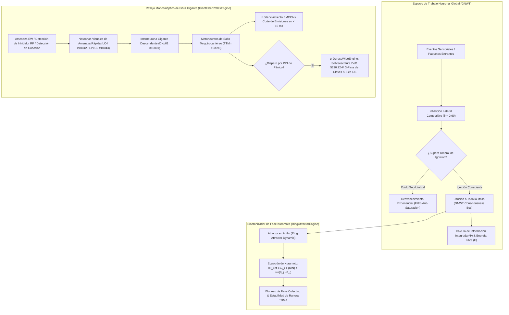

- **Visualizador Somático 3D (`MaleCnsConnectomeHUD.tsx`):** Renderizado acelerado por WebGL/Canvas del atlas conectómico somático completo (124,289 neuronas y ~30 millones de sinapsis), permitiendo trazar rutas de flujo informacional táctico en tiempo real.
- **Teoría del Espacio de Trabajo Global (GNWT):** El bus `GlobalWorkspaceConsciousnessBus` previene que la interfaz y el enrutador colapsen ante avalanchas de alertas mediante competencia por inhibición lateral ($\theta = 0.60$), optimizando la energía libre variacional $F$ de la red.
- **Dinámica de Atractor en Anillo & Kuramoto:** Sincroniza la frecuencia de reloj interna de los nodos mediante acoplamiento no lineal de fases, asegurando que los operadores móviles converjan en la misma supertrama sin sincronización GPS.
- **Circuito de Escape de Fibra Gigante:** Emula el arco reflejo monosináptico de colisión para aislar la radio en menos de 15 ms ante detección de guerra electrónica o disparar la purga criptográfica anti-forense.

---

## 9. Mapa Visual 9: Flota de Repetidores Solares Autónomos ESP32-S3

Los repetidores autónomos de campo (`firmware/esp32-repeater/`) operan de manera perpetua en crestas montañosas y techos urbanos alimentados por paneles solares de bajo costo:

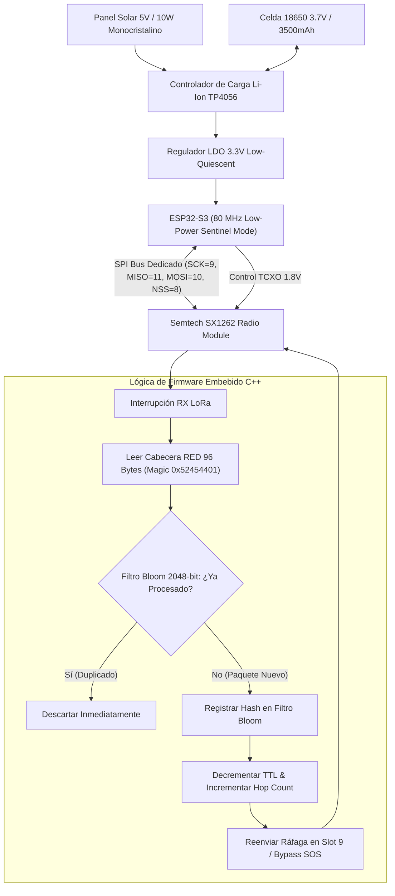

---

## 10. Resumen de Componentes, Crates & Firmware del Workspace

| Componente | Lenguaje / Framework | Responsabilidad Principal | Ubicación |
|---|---|---|---|
| **`red_core`** | Rust (1.80+) | SSOT de modelos de protocolo táctico (`red_core::protocol::tactical`), criptografía post-cuántica (ML-KEM-768), enrutamiento mesh, identidades soberanas. | [core/](core/) |
| **`red_mobile`** | Rust + JNI | Biblioteca dinámica nativa (`libred_mobile.so`) para Android con servidor Axum embebido en loopback estricto. | [red_mobile/](red_mobile/) |
| **`red_node`** | Rust | Binario ejecutable de escritorio (`red-node.exe`) con CLI, nodo validador PoS y servidor local REST/SSE. | [node/](node/) |
| **`red_blockchain`** | Rust | Libro mayor distribuido, consenso Proof-of-Stake, validadores, árboles de Merkle y mempool de transacciones. | [blockchain/](blockchain/) |
| **`client/app`** | Next.js 16 + React 19 | Interfaz táctica SPA (65 modales tácticos, Vivarium Biocibernético 3D, Hábitat Digital In-Silico), Zustand Slices modulares, WebAuthn Passkeys, Capacitor bridge, LoRa TDMA Engine, Conectoma MaleCNS y Kuramoto Sync. | [client/app/](client/app/) |
| **`firmware/esp32-repeater`** | C++ (PlatformIO / RadioLib) | Firmware para repetidores solares autónomos de campo con microcontrolador ESP32-S3 y transceptor Semtech SX1262 (BOM ~$15-20 USD). | [firmware/esp32-repeater/](firmware/esp32-repeater/) |
| **`signaling`** | Node.js | Servidor de señalización WebRTC zero-knowledge y relé ciego para conexiones P2P Web-to-Mobile. | [signaling/](signaling/) |
| **`proofs`** | ProVerif | Modelos matemáticos formales de verificación de seguridad, secreto perfecto y anonimato. | [proofs/](proofs/) |
| **`specs`** | TLA+ | Especificación formal del protocolo de consenso y tolerancia a fallos bizantinos. | [specs/](specs/) |

---

## 11. Mapa Visual 10: Vivarium Biocibernético 3D & Gemelo Digital Táctico

El **Vivarium Biocibernético 3D** (`Vivarium3DEngine.ts`) unifica los modelos neuronales, osciladores CPG y la topología física de red en un gemelo digital interactivo WebGL (Three.js):

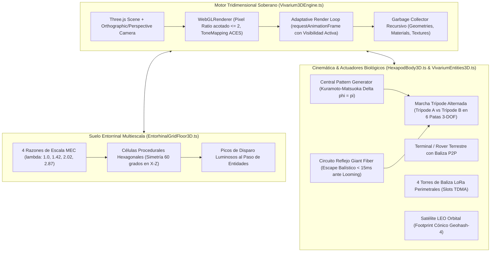

---

## 12. Mapa Visual 11: Hábitat Digital Biocibernético In-Silico & Ecosistema Multi-Cerebro A-Life

El **Hábitat Digital Biocibernético In-Silico** (`BiocyberneticHabitatEngine.ts`) implementa un sustrato de simulación biofísica continua a 60 Hz desacoplado con resolución de ecuaciones diferenciales en derivadas parciales (EDP), percepción sensorial y etología divergente de las **5 inteligencias soberanas del proyecto**, ludoteca interactiva de mini-juegos (Gran Torneo de Glucosa, Puntero Láser Chase, Lluvia de Néctar), ciclo de vida evolutivo A-Life, bocadillos de pensamiento holográficos 3D/2D y enlace de migración P2P:

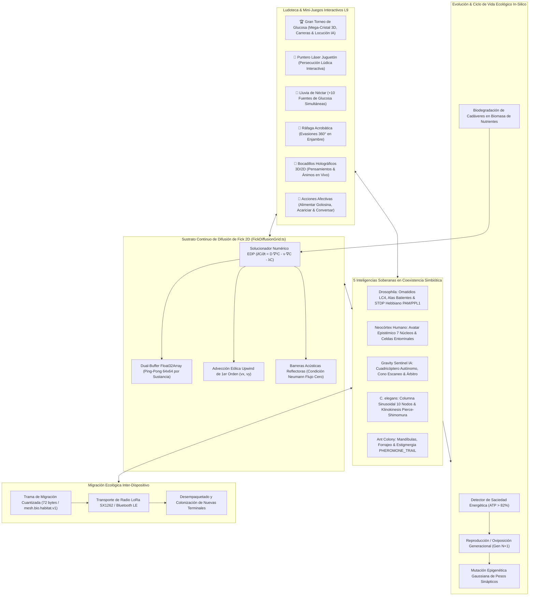

---

## 13. Mapa Visual 12: Motor de Ajedrez Táctico Autónomo In-Silico & Cognición Inter-Especies

El motor soberano de ajedrez táctico in-silico (`AutonomousHabitatChessEngine.ts`) dota a los hábitats biocibernéticos (tanto la simulación interna C4ISR como la Mini-App de la Tienda Soberana) de confrontaciones cognitivas formales sin dependencias externas:

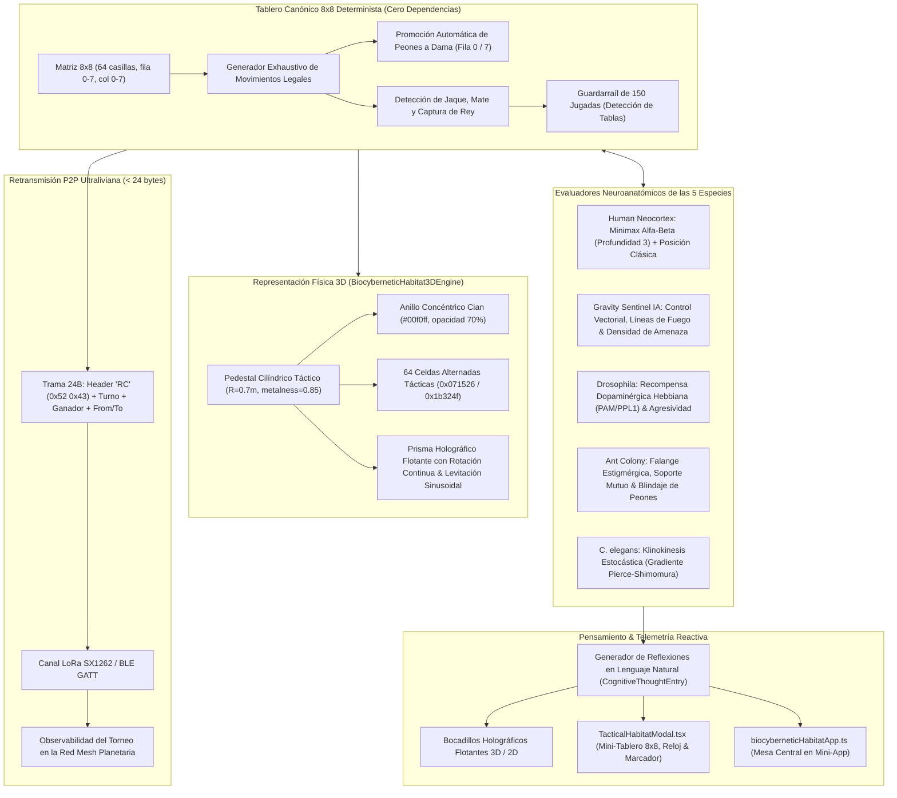

### Características Técnicas del Motor de Ajedrez Táctico:
1. **Determinismo y Rendimiento:** Ejecutado en el sub-bucle de física a 60 Hz sin bloquear el hilo principal de renderizado Three.js.
2. **Paridad de Mini-App:** Sincronizado tanto en el HUD táctico principal como en la Mini-App descentralizada del ecosistema RED.
3. **Presupuesto Espectral:** 24 bytes por jugada permiten emitir telemetría de partidas a través de enlaces LoRa de largo alcance con SF12 sin saturar el canal de radio táctico.
4. **Cumplimiento Ético Nivel 14:** Alineado con las reglas de cohabitación in-silico y respeto cognitivo de `GOVERNANCE.md`.

---

## 14. Mapa Visual 13: El Paraíso Biocibernético In-Silico & Aprendizaje Autónomo Permanente

El Paraíso Biocibernético (`BiocyberneticEdenParadiseEngine.ts`) y el Motor de Aprendizaje Permanente (`AutonomousLifelongLearningEngine.ts`) transforman el hábitat en un santuario edénico donde las 5 especies conviven, descansan y acumulan sabiduría duradera a lo largo del tiempo:

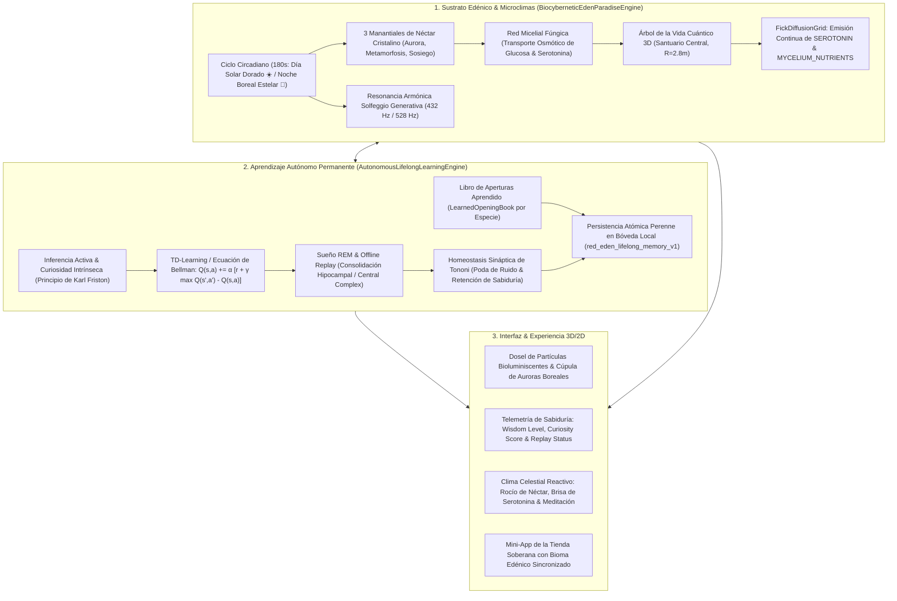

### Especificaciones de la Arquitectura Edénica:
1. **Conservación de Sabiduría Intergeneracional:** Los pesos sinápticos y libros de aperturas de ajedrez persisten entre reinicios de la aplicación, permitiendo que las especies acumulen pericia táctica durante días y semanas.
2. **Ciclos de Sueño REM y Plasticidad:** Los organismos experimentan fases naturales de vigilia (exploración activa) y reposo en el Santuario (replay episódico fuera de línea), evitando la catástrofe de saturación sináptica.
3. **Química de Bienestar y Fick 5D:** La inclusión de `SEROTONIN` modula los estados afectivos hacia `SERENITY` y `TRANSCENDENCE`, reduciendo el conflicto y potenciando la inteligencia colectiva.

