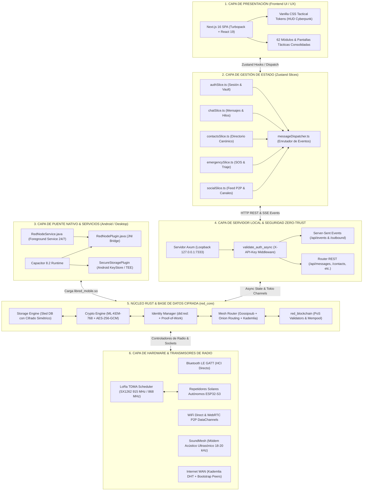
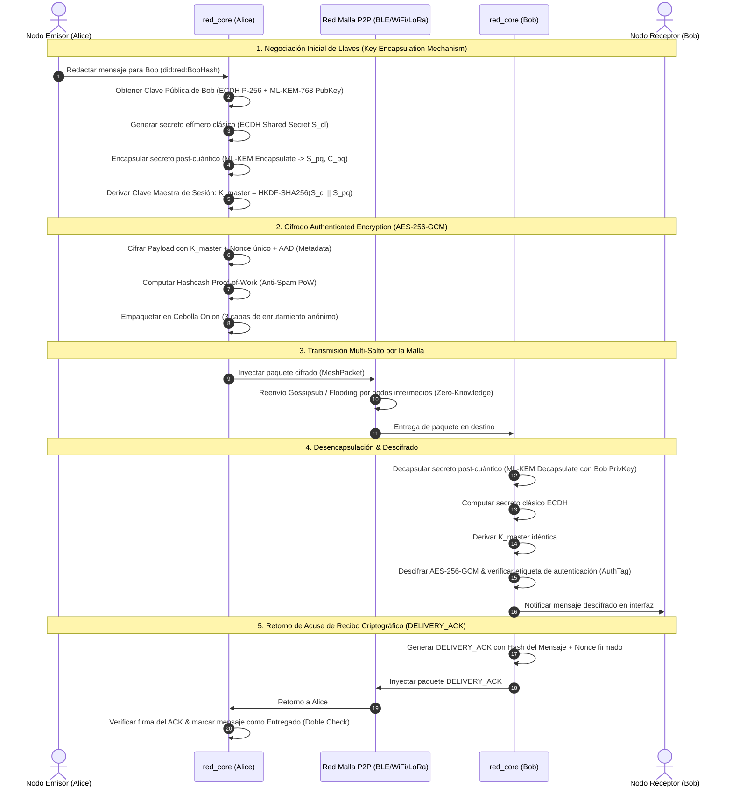
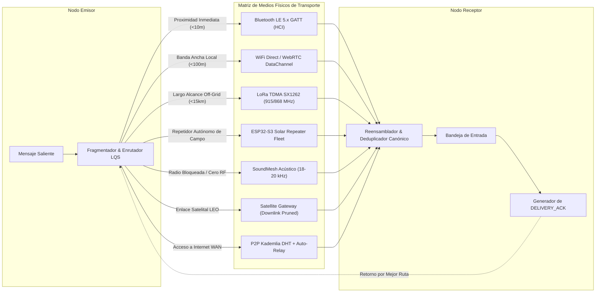
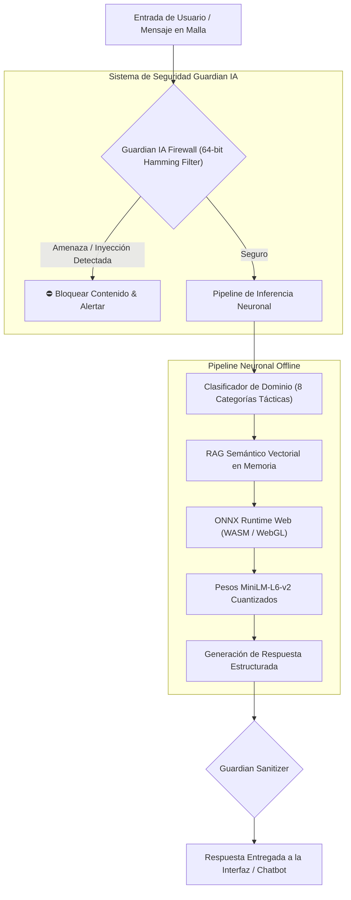
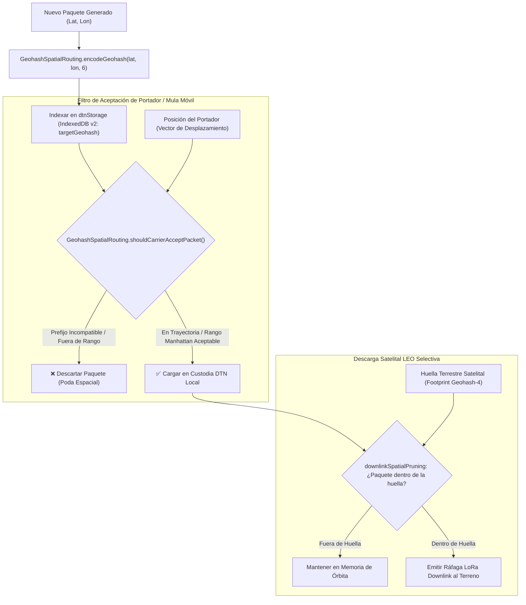
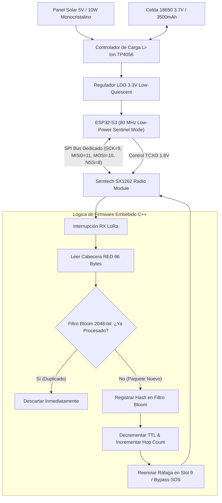

# 🛡️ RED OS v98.0.0 — Arquitectura Técnica & Especificación Planetaria

> Documento maestro de ingeniería de software y especificación arquitectónica de **RED (Red Criptográfica Off-Grid & P2P Mesh)**. Describe en detalle la topología de capas, los protocolos criptográficos híbridos post-cuánticos, la coordinación espectral LoRa TDMA, el enrutamiento geoespacial Geohash DTN, la flota de repetidores solares autónomos ESP32-S3 y el catálogo consolidado de 62 módulos y modales tácticos.

---

## 📋 Índice General

1. [Mapa Visual 1: Topología Global del Sistema & Conexión de Capas](#1-mapa-visual-1-topología-global-del-sistema--conexión-de-capas)
2. [Mapa Visual 2: Flujo Criptográfico Híbrido Post-Cuántico (ML-KEM-768 + Double Ratchet)](#2-mapa-visual-2-flujo-criptográfico-híbrido-post-cuántico)
3. [Mapa Visual 3: Autenticación Soberana, Biometría TEE/WebAuthn & Bóveda Cifrada](#3-mapa-visual-3-autenticación-soberana-biometría-teewebauthn--bóveda-cifrada)
4. [Mapa Visual 4: Matriz de Enrutamiento Mesh Multi-Transporte & Protocolo ACKs](#4-mapa-visual-4-matriz-de-enrutamiento-mesh-multi-transporte--protocolo-acks)
5. [Mapa Visual 5: Motor de Inteligencia Artificial Offline & Guardian Security Firewall](#5-mapa-visual-5-motor-de-inteligencia-artificial-offline--guardian-security-firewall)
6. [Mapa Visual 6: Enrutamiento Geoespacial Geohash & Poda DTN (IndexedDB v2)](#6-mapa-visual-6-enrutamiento-geoespacial-geohash--poda-dtn)
7. [Mapa Visual 7: Coordinación Espectral LoRa TDMA (Supertrama 2000ms & CSMA/CA)](#7-mapa-visual-7-coordinación-espectral-lora-tdma)
8. [Mapa Visual 8: Flota de Repetidores Solares Autónomos ESP32-S3 & Hardware SX1262](#8-mapa-visual-8-flota-de-repetidores-solares-autónomos-esp32-s3)
9. [Resumen de Componentes, Crates & Firmware del Workspace](#9-resumen-de-componentes-crates--firmware-del-workspace)

---

## 1. Mapa Visual 1: Topología Global del Sistema & Conexión de Capas

El ecosistema RED opera bajo una arquitectura desacoplada de 6 capas horizontales con aislamiento estricto de memoria y enlaces de comunicación IPC seguros:

---

## 2. Mapa Visual 2: Flujo Criptográfico Híbrido Post-Cuántico

RED utiliza un esquema criptográfico de doble capa que combina criptografía de curva elíptica tradicional con algoritmos estandarizados por el NIST resistentes a computación cuántica (**FIPS 203 ML-KEM-768**):

---

## 3. Mapa Visual 3: Autenticación Soberana, Biometría TEE/WebAuthn & Bóveda Cifrada

La autenticación en RED garantiza aislamiento criptográfico absoluto de la base de datos `sled`, sin contraseñas en texto plano ni puertas traseras:

---

## 4. Mapa Visual 4: Matriz de Enrutamiento Mesh Multi-Transporte & Protocolo ACKs

RED selecciona dinámicamente el mejor medio físico de transmisión basándose en la disponibilidad de hardware, la proximidad del par y las métricas de enlace LQS (*Link Quality Score*):

---

## 5. Mapa Visual 5: Motor de Inteligencia Artificial Offline & Guardian Security Firewall

RED integra un modelo de lenguaje neuronal y un sistema de seguridad semántica 100% offline que se ejecuta localmente en el dispositivo mediante WebAssembly y aceleración SIMD:

---

## 6. Mapa Visual 6: Enrutamiento Geoespacial Geohash & Poda DTN

Para evitar que mulas de datos móviles y satélites LEO colapsen sus memorias transportando tráfico global irrelevante, RED implementa el enrutamiento geoespacial por cuadrantes Geohash:

---

## 7. Mapa Visual 7: Coordinación Espectral LoRa TDMA

El planificador `LoRaTdmaSchedulerEngine` organiza el espectro sub-GHz en supertramas periódicas de 2000 ms divididas en 10 slots de 200 ms, eliminando colisiones en concentraciones masivas de operadores:

- **Slots 0–7 (Deterministas):** Asignados de forma matemáticamente reproducible según el DID del nodo. Cero colisiones entre nodos con slots distintos.
- **Slot 8 (Baliza & Sincronización):** Transmisión de metadatos de sincronización temporal y topología de red.
- **Slot 9 (Contienda Dinámica):** Acceso aleatorio mediante CSMA/CA con retroceso exponencial (*exponential backoff*) para nodos transitorios.
- **Bypass de Emergencia SOS (Prioridad >= 9):** Interrumpe de inmediato cualquier supertrama en curso y transmite ráfagas de socorro al aire sin demoras de slot.

---

## 8. Mapa Visual 8: Flota de Repetidores Solares Autónomos ESP32-S3

Los repetidores autónomos de campo (`firmware/esp32-repeater/`) operan de manera perpetua en crestas montañosas y techos urbanos alimentados por paneles solares de bajo costo:

---

## 9. Resumen de Componentes, Crates & Firmware del Workspace

| Componente | Lenguaje / Framework | Responsabilidad Principal | Ubicación |
|---|---|---|---|
| **`red_core`** | Rust (1.80+) | SSOT de modelos de protocolo táctico (`red_core::protocol::tactical`), criptografía post-cuántica, enrutamiento mesh, identidades soberanas. | [core/](core/) |
| **`red_mobile`** | Rust + JNI | Biblioteca dinámica nativa (`libred_mobile.so`) para Android con servidor Axum embebido. | [red_mobile/](red_mobile/) |
| **`red_node`** | Rust | Binario ejecutable de escritorio (`red-node.exe`) con CLI, nodo validador y servidor local. | [node/](node/) |
| **`red_blockchain`** | Rust | Libro mayor distribuido, consenso Proof-of-Stake, validadores y mempool de transacciones. | [blockchain/](blockchain/) |
| **`client/app`** | Next.js 16 + React 19 | Interfaz táctica SPA (62 modales tácticos), Zustand Slices modulares, WebAuthn Passkeys, Capacitor bridge y LoRa TDMA Engine. | [client/app/](client/app/) |
| **`firmware/esp32-repeater`** | C++ (PlatformIO / RadioLib) | Firmware para repetidores solares autónomos de campo con microcontrolador ESP32-S3 y transceptor Semtech SX1262. | [firmware/esp32-repeater/](firmware/esp32-repeater/) |
| **`signaling`** | Node.js | Servidor de señalización WebRTC zero-knowledge y relé ciego para conexiones P2P. | [signaling/](signaling/) |
| **`proofs`** | ProVerif | Modelos matemáticos formales de verificación de seguridad, secreto perfecto y anonimato. | [proofs/](proofs/) |
| **`specs`** | TLA+ | Especificación formal del protocolo de consenso y tolerancia a fallos bizantinos. | [specs/](specs/) |
