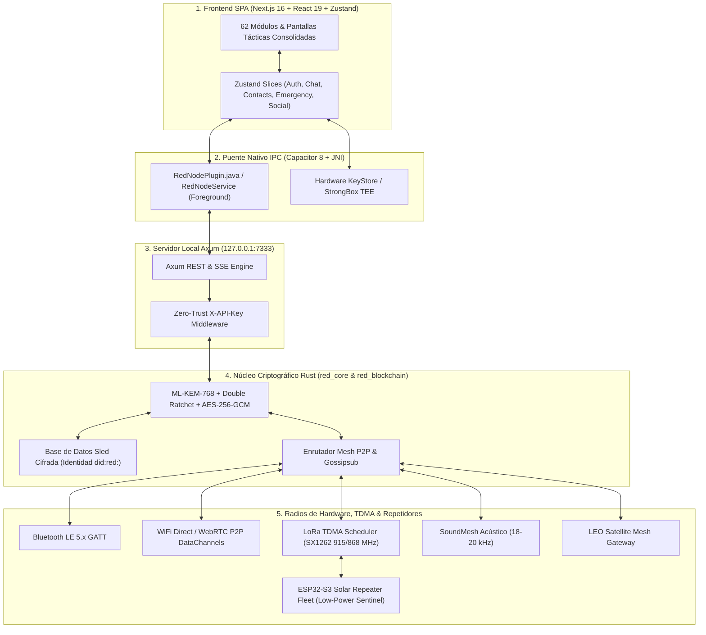

# 🛡️ RED — Sovereign Mesh OS v100.0.0

> **RED** (Red Criptográfica Off-Grid & P2P Mesh) es la plataforma de comunicaciones tácticas, descentralizadas y soberanas más avanzada del mundo. Diseñada desde su origen para operar bajo escenarios de apagón tecnológico, censura estatal, desastres naturales o denegación de servicios, RED no depende de servidores centrales, infraestructuras celulares ni conexión a Internet. Ahora con el **Modo Familiar (WhatsApp UX)** integrado, **Coordinación Espectral LoRa TDMA**, **Enrutamiento Geoespacial Geohash** y **Repetidores Solares Autónomos ESP32-S3**.

[](https://github.com/DarckRovert/RED/releases/tag/v100.0.0)
[](https://darckrovert.github.io/RED/)
[](https://github.com/DarckRovert/RED/blob/main/LICENSE)
[](https://github.com/DarckRovert/RED)
[](https://github.com/DarckRovert/RED)
[](https://github.com/DarckRovert/RED)

---

## 📚 Centro de Documentación & Manuales

Accede a la documentación técnica y operativa completa del proyecto:

- 📖 **[Manual de Usuario Táctico (USER_MANUAL.md)](USER_MANUAL.md)**: Guía de uso paso a paso de los 8 Hubs Tácticos Consolidados y las 62 pantallas modales para operadores finales.
- ⚙️ **[Manual de Administración y Nodos (ADMIN_MANUAL.md)](ADMIN_MANUAL.md)**: Configuración de nodos de escritorio en PC, repetidores solares autónomos ESP32-S3 y telemetría de slots TDMA.
- 📐 **[Arquitectura de Protocolos (ARCHITECTURE.md)](ARCHITECTURE.md)**: Diagramas formales de ingeniería, stack de capas, supertrama TDMA y enrutamiento Geohash.
- 🛰️ **[Firmware de Repetidores Solares (firmware/esp32-repeater/README.md)](firmware/esp32-repeater/README.md)**: Guía de montaje de hardware de bajo costo (~$15-20 USD), esquema solar TP4056 y flasheo PlatformIO.
- 📡 **[Especificación Formal de Protocolo (docs/PROTOCOL_SPEC.md)](docs/PROTOCOL_SPEC.md)**: Formato de trama binaria RED de 96 bytes, acuerdos HPKE y filtros Bloom de deduplicación.
- 📜 **[Historial de Versiones (CHANGELOG.md)](CHANGELOG.md)**: Registro exhaustivo de cambios y novedades de cada release.
- 🚀 **[Guía de Inicio Rápido (GETTING_STARTED.md)](GETTING_STARTED.md)**: Instrucciones para desarrolladores y configuración de dependencias.

---

## 📋 Tabla de Contenidos

1. [Visión General & Filosofía de Diseño](#vision-general)
2. [Arquitectura del Sistema & Mapa Visual](#arquitectura-sistema)
3. [Autenticación Biométrica Universal & Seguridad Zero-Trust](#autenticacion-biometrica)
4. [Conectividad Global & Red Malla Descentralizada](#conectividad-global)
5. [Catálogo Consolidado de 62 Módulos & Pantallas Tácticas](#catalogo-modulos)
6. [Criptografía Post-Cuántica & Privacidad en Capas](#criptografia-post-cuantica)
7. [Tokenomics & Proof-of-Relay](#tokenomics)
8. [Guía de Compilación & Despliegue](#guia-compilacion)

---

<a id="vision-general"></a>
## 🔭 1. Visión General & Filosofía de Diseño

En situaciones de emergencia o denegación de red, las aplicaciones tradicionales de mensajería (WhatsApp, Telegram, Signal) fallan al depender de servidores centrales en la nube y torres de telefonía celular. **RED** rompe esta dependencia convirtiendo cada dispositivo en un **nodo de red mesh independiente** capaz de cifrar, enrutar y entregar mensajes a través de radios de hardware locales y enlazar globalmente cuando exista un puente de red.

| Característica | Aplicaciones Tradicionales | RED v100.0.0 |
|---|---|---|
| **Interfaz & UX** | Saturada y con menús dispersos | **Doble Modo Soberano: Modo Familiar (WhatsApp UX) + Modo Táctico C4ISR (8 Hubs, 62 Pantallas)** |
| **Infraestructura** | Requiere servidores en la nube y 4G/5G | **100% Descentralizado / Zero-Server** |
| **Operación Off-Grid** | Imposible sin Internet | **Totalmente funcional mediante BLE GATT, WiFi Direct, LoRa 915MHz y SoundMesh Ultrasónico** |
| **Coordinación LoRa** | Acceso ALOHA caótico con colisiones masivas | **Planificador LoRa TDMA: Supertrama de 2000ms (10 slots de 200ms), FNV-1a y Bypass SOS Prioridad 9** |
| **Enrutamiento Espacial** | Inundación ciega de la red | **Poda Geoespacial Geohash-4/6 en IndexedDB v2 & Filtrado Satelital LEO Downlink** |
| **Repetidores de Campo** | Infraestructura de antenas celulares costosas | **Repetidores Solares Autónomos ESP32-S3 de bajo costo (~$15-20 USD BOM, <12mA en reposo)** |
| **IA Local Adaptativa** | Requiere APIs en la nube / Defaults fijos | **Asignación Dinámica de RAM (`DeviceMemoryBudget`), Inferencia WASM Qwen/SmolLM & RAG INT8 (<5ms)** |
| **Llaves Biométricas** | Dependiente de cuenta/SMS | **Universal: Huella, Rostro, Iris, Windows Hello, Touch ID y Passkeys WebAuthn** |
| **Aislamiento de Red** | Endpoints expuestos a LAN | **Zero-Trust: Servidor Axum estrictamente enlazado a Loopback `127.0.0.1:7333`** |
| **Validación de Bóveda** | Generación efímera insegura | **Verificación estricta de desencriptación en Sled DB con aborto fatal ante PIN erróneo** |
| **Autorización Consent-First** | Sin control de adición en malla | **Protección Anti-Acoso: Solicitudes de contacto con aceptación/rechazo explícito y lista negra** |
| **IA 100% Offline** | Requiere APIs de servidores en la nube | **RAG Semántico Acelerado (<120ms), Clasificador de 8 Dominios y Guardian Hamming 64-bit locales** |
| **Interoperabilidad Web PC** | Limitada a clientes cerrados | **Web App SPA en PC interoperable en tiempo real con nodos móviles Android** |
| **Conectividad Global** | Centralizada en servidores corporativos | **P2P Kademlia DHT + Bootstrap Peers + Auto-Relay Circuit v2 + DoH Tunnels** |
| **Respaldo & Recuperación** | Dependiente de cuentas de usuario / SMS | **1-Toque Zero-Friction: Cifrado AES-256-GCM + Google Drive + IPFS + Frase Semilla BIP-39** |
| **Identidad & Web3** | Vinculada a número telefónico/email | **Soberana (`did:red:`) + EIP-712 MetaMask Multi-Chain Binding** |
| **Criptografía** | Clásica (vulnerable a computación cuántica) | **Híbrida Post-Cuántica: ML-KEM-768 (FIPS 203) + ECDH P-256 + AES-256-GCM** |
| **Audio Táctico** | Códecs pesados (WebM/AAC 32-64 kbps) | **LowBitrateVocoder DSP (8kHz IMA-ADPCM 1.6–3.2 kbps, -97.9% compresión)** |
| **Cero Datos Ficticios** | Simulación en modo demo | **0% Datos Hardcodeados / 100% Funcionalidad Real Verificada en Hardware** |

---

<a id="arquitectura-sistema"></a>
## 📐 2. Arquitectura del Sistema & Mapa Visual

Para una documentación exhaustiva de los diagramas técnicos de ingeniería, consulta [ARCHITECTURE.md](ARCHITECTURE.md).



---

<a id="autenticacion-biometrica"></a>
## 🔐 3. Autenticación Biométrica Universal & Seguridad Zero-Trust

RED v100.0.0 incorpora un guardián de hardware que vincula el chip de seguridad del dispositivo a la base de datos `sled`:

1. **Soporte Biométrico Completo:**
   - **Android Nativo:** Sensor de huella dactilar, reconocimiento facial 3D/IR, escáner de iris y credenciales de dispositivo mediante `BiometricPrompt` (`USE_BIOMETRIC` + `USE_FINGERPRINT`).
   - **Web / Desktop (PC & Mac):** API WebAuthn / Passkeys (`navigator.credentials`) compatible con **Windows Hello**, **Apple Touch ID / Face ID** y llaves FIDO2 físicas.
2. **Derivación de Claves Segura:** La validación biométrica positiva libera el `master_pin` desde el KeyStore/WebAuthn, el cual deriva la clave simétrica con **Argon2id** para abrir la base de datos Sled.
3. **Protocolo Anti-Coacción:** Permite desactivar el auto-prompt biométrico en zonas de riesgo para posibilitar el ingreso discreto del PIN de Señuelo (`decoy_pin`), abriendo la **Bóveda Señuelo**.

---

<a id="conectividad-global"></a>
## 🌐 4. Conectividad Global & Red Malla Descentralizada

RED implementa una arquitectura híbrida **Offline-to-Global Gateway** con tolerancia absoluta a fallos de infraestructura:

1. **Planificador LoRa TDMA**: Sincronización en supertramas de 2000 ms divididas en 10 slots de 200 ms. Slots 0-7 asignados de forma determinista mediante hash FNV-1a del identificador de nodo, slot 8 reservado para balizas y slot 9 asignado a contienda dinámica CSMA/CA con backoff exponencial. Ráfagas de emergencia SOS (prioridad >= 9) transmiten de forma inmediata con bypass de supertrama.
2. **Enrutamiento Espacial Geohash DTN**: Indexación por cuadrantes espaciales en IndexedDB v2. Los paquetes en tránsito se etiquetan con su Geohash de destino; las mulas móviles de datos y los satélites LEO descartan tráfico fuera de su vector geográfico de desplazamiento mediante `GeohashSpatialRouting.shouldCarrierAcceptPacket`.
3. **Flota de Repetidores Solares Autónomos ESP32-S3**: Hardware de despliegue en campo con panel solar de 5V y celda 18650, operando a 80 MHz con un consumo centinela inferior a 12 mA, filtro Bloom de 2048 bits para descarte de duplicados y transceptor Semtech SX1262 con oscilador TCXO a 1.8V.
4. **Observador de Transición de Red (`NetworkWatcher`)**: Detección en tiempo real de cambios de interfaz (WiFi $\leftrightarrow$ Celular $\leftrightarrow$ Off-Grid).
5. **WebRTC P2P DataChannels & `iceRestart`**: Re-negociación ICE en caliente sin pérdida de sesión.

---

<a id="catalogo-modulos"></a>
## 🧰 5. Catálogo Consolidado de 62 Módulos & Pantallas Tácticas

1. **Canales Mesh Locales:** Salas temáticas abiertas con moderación por IA.
2. **RED Social Feed P2P:** Microblogging descentralizado sin censura.
3. **Difusión Privada (Broadcast):** Comunicados masivos cifrados.
4. **Walkie-Talkie Push-To-Talk:** Radio digital de voz con códec Vocoder (1.6–3.2 kbps).
5. **Canvas Táctico P2P:** Pizarra colaborativa de planos tácticos en tiempo real.
6. **Live Broadcast Stream:** Transmisión y visualización de video P2P local.
7. **Shake & Pair:** Emparejamiento instantáneo por acelerómetro (>15 m/s²).
8. **Radar Topográfico GPS & UTM:** Brújula digital con declinación WMM2025 y barómetro.
9. **Mapa de Nodos P2P:** Visualización geoespacial de nodos y telemetría de enlace.
10. **Radar Hardware BLE / WiFi:** Escáner pasivo de espectro electromagnético.
11. **Analizador Espectro RF / EW:** Monitoreo de interferencias y guerra electrónica.
12. **Ondas de Proximidad:** Detección de pares cercanos por firma de radio.
13. **Clima & Barómetro CAP:** Alertas meteorológicas y presión atmosférica local.
14. **Batería Eco-Mesh:** Gobernador cinemático de energía (hasta 48h de autonomía).
15. **Consenso Blockchain PoS:** Validación de bloques y staking descentralizado.
16. **Vales Criptográficos P2P:** Economía soberana offline y paridad en Soles (PEN).
17. **Cápsula de Esteganografía:** Ocultamiento de archivos dentro de imágenes PNG/WAV.
18. **Interruptor del Hombre Muerto (DMS):** Purga programada en caso de captura o pérdida.
19. **Triaje Médico START:** Clasificación de víctimas en emergencias con código de colores.
20. **Baliza de Emergencia SOS:** Transmisión continua de auxilio por radio y sonido.
21. **SoundMesh Ultrasónico:** Módem acústico por altavoz en 18–20 kHz BFSK.
22. **Auditoría de Seguridad OPSEC:** Chequeo en tiempo real de fugas de datos y hardware.
23. **Calculadora Señuelo:** Disfraz funcional que oculta la aplicación tras una calculadora real.
24. **Bóveda Señuelo (Decoy Vault):** Espacio aislado con datos inocentes para casos de coacción.
25. **Almacén Cifrado Sled:** Base de datos embebida con cifrado simétrico AES-256-GCM.
26. **Árbol Merkle State Integrity:** Verificación criptográfica y autorreparación de estado.
27. **Guardian IA Firewall:** Filtro semántico de seguridad con distancia de Hamming de 64 bits.
28. **RAG Semántico Vectorial:** Base de conocimiento táctica offline con embeddings locales.
29. **IA Copilot Táctico:** Asistente neuronal offline basado en `LaMini-Flan-T5`.
30. **LowBitrateVocoder DSP:** Compresión de audio de ultra-bajo ancho de banda (-97.9%).
31. **Mesh Proof-of-Work:** Hashcash descentralizado contra ataques Sybil y DDoS.
32. **Web Companion QR:** Vinculación segura entre clientes Web en PC y la App Móvil.
33. **Respaldo Soberano 1-Toque:** Copias de seguridad cifradas en Google Drive e IPFS.
34. **MetaMask EIP-712:** Vinculación de identidades soberanas a billeteras Web3.
35. **Gestor de Contactos Consent-First:** Protección anti-acoso con listas de confianza y bloqueo.
36. **Transmisión de Archivos Fragmentados:** Envío P2P de documentos y fotos por malla.
37. **Llamadas de Voz Cifradas WebRTC:** Comunicaciones de audio bidireccional punto a punto.
38. **Videollamadas de Baja Latencia:** Video P2P cifrado con DTLS-SRTP.
39. **Gobernador de Canal RF:** Salto adaptativo de frecuencias y control de congestión.
40. **Telemetría de Enlace LQS:** Medición continua de RSSI, SNR y pérdida de paquetes.
41. **Autenticación Biométrica Universal:** Desbloqueo por huella, rostro, iris o Passkeys.
42. **Auto-Bloqueo por Inactividad:** Sentinel de visibilidad y ciclo de vida de la app.
43. **Coordinador LoRa TDMA:** Asignación y visualización en tiempo real de slots espectrales.
44. **Cuadrantes Geohash DTN:** Selector de resolución espacial (longitudes 4 a 6) para enrutamiento.
45. **Telemetría de Repetidor Solar:** Monitor de batería, rendimiento de retransmisión y drops de filtro Bloom.
46. **Gateway Satelital LEO:** Panel de pases orbitales y cola de descarga bent-pipe.
47. **Visor CAD Táctico Vectorial:** Renderizado SVG 4K de planos de 4 capas y topología de red.
48. **Detector CBRN & Radiación:** Mapeo y alertas de radiación ambiental y gases tóxicos.
49. **Navegación Celeste & PDR:** Navegación por estrellas y Dead Reckoning peatonal sin GPS.
50. **Triangulación RDF:** Radio Direction Finding para búsqueda de radiobalizas enemigas o amigas.
51. **Búnker Anti-Forense:** Borrado criptográfico multinivel conforme a estándares DoD 5220.22-M.
52. **Túneles Encubiertos DoH:** Ofuscación de tráfico en túneles DNS-over-HTTPS.
53. **Monitor Sísmico & Salud Estructural:** Registro acelerométrico de ondas P y S en terremotos.
54. **Purificación de Agua Táctica:** Calculadora de dosificación química y protocolos de desinfección.
55. **TCCC & Balística Táctica:** Registro de torniquetes, soporte vital de combate y tablas de tiro.
56. **Escáner LiFi & Morse Óptico:** Transmisión de datos por modulación de linterna LED del teléfono.
57. **Sensor Óptico de Gases:** Detección fotométrica de partículas en suspensión mediante cámara.
58. **C4ISR CoT & Sitrep:** Mensajería estandarizada Cursor-on-Target militar para interoperabilidad.
59. **Gobernador de Batería Cinético:** Gestión de energía acoplada a la actividad motriz del operador.
60. **Bóveda de Trueque P2P:** Intercambio descentralizado de suministros y recursos en crisis.
61. **Sigint Subterráneo:** Análisis de señales acústicas y vibraciones de suelo.
62. **Resguardo de Secretos Shamir:** Custodia fragmentada de claves maestras entre el escuadrón.

---

<a id="criptografia-post-cuantica"></a>
## 🛡️ 6. Criptografía Post-Cuántica & Privacidad en Capas

RED implementa una suite criptográfica híbrida diseñada para resistir tanto adversarios clásicos como ataques de computación cuántica futura:

1. **Intercambio de Claves Híbrido Post-Cuántico (PQ-KEM):**
   - **NIST FIPS 203 ML-KEM-768 (Kyber):** Encapsulación de clave basada en retículos resistente a ordenadores cuánticos.
   - **ECDH X25519:** Intercambio clásico de alto rendimiento.
   - **Combinador HKDF-SHA256:** Deriva claves simétricas que garantizan seguridad si al menos uno de los dos algoritmos permanece seguro.
2. **Cifrado Simétrico Autenticado:**
   - **ChaCha20-Poly1305 / AES-256-GCM:** Cifrado AEAD para cargas útiles de mensajes y bases de datos locales.
3. **Esquema de Secreto Compartido de Shamir (SSS):**
   - División de claves maestras en umbrales $k$-de-$n$ en el cuerpo finito $GF(2^8)$ para recuperación soberana entre pares de confianza.
4. **Esteganografía LSB Táctica:**
   - Inyección discreta de paquetes cifrados en bits menos significativos de imágenes y pistas de audio.

---

<a id="tokenomics"></a>
## ⚡ 7. Tokenomics & Proof-of-Relay

El sistema integra una economía descentralizada autónoma para incentivar la retransmisión de paquetes y el comercio offline:

1. **Proof-of-Relay (PoR):** Cada nodo que actúa como repetidor de paquetes para la malla acumula créditos de retransmisión computados localmente.
2. **Consenso Proof-of-Stake Soberano:** Motor de cadena local con árbol de Merkle real, cálculo de nonces y forja de bloques por ranuras de tiempo (`slots`).
3. **Vales P2P Criptográficos Off-Grid:** Emisión de comprobantes de pago firmados con SHA-256 y códigos QR bidimensionales para transacciones comerciales sin conexión a Internet, con prevención de doble gasto mediante libro mayor local.

---

<a id="guia-compilacion"></a>
## 🛠️ 8. Guía de Compilación & Despliegue

### 1. Compilación del Frontend Web
```bash
cd client/app
npm install
npm run build
```

### 2. Ejecución de Pruebas Automatizadas de Malla
```bash
# Validar planificador LoRa TDMA
npm run test:tdma

# Validar enrutamiento geoespacial Geohash
npm run test:geohash

# Validar suite completa de pruebas unitarias
npm run test:all
```

### 3. Compilación del Nodo Rust (Workspace)
```bash
cargo build --release --bin red-node
cargo test --workspace
```

### 4. Compilación de Firmware para Repetidores ESP32-S3
```bash
cd firmware/esp32-repeater
pio run -e heltec_wifi_lora_32_v3
pio run -e heltec_wifi_lora_32_v3 -t upload
```

### 5. Compilación Nativa y Empaquetado APK
```bash
# Sincronizar plugins de Capacitor
npx cap sync android

# Compilar bibliotecas ARM64 con NDK y generar APK de Release
cd client/app/android
./gradlew assembleRelease

# Instalar en dispositivo conectado vía ADB
adb install -r app/build/outputs/apk/release/app-release.apk
```

---

<a id="licencia"></a>
## 📄 Licencia & Descargo Legal

Este proyecto está licenciado bajo la **GNU Affero General Public License v3.0 (AGPL-3.0)** — Copyright (C) 2026 Rodrigo Alejandro Vega Rojas (alias "DarckRovert") / RED Sovereign Mesh Team. Consulta el archivo [LICENSE](LICENSE) para más detalles.

> ⚠️ **Aviso Táctico & Descargo de Responsabilidad:** El uso de este software en operaciones de emergencia, telecomunicaciones o rescate se realiza bajo la exclusiva responsabilidad del usuario. Consulta los términos legales vinculantes en el [Descargo de Responsabilidad (DISCLAIMER.md)](DISCLAIMER.md).
