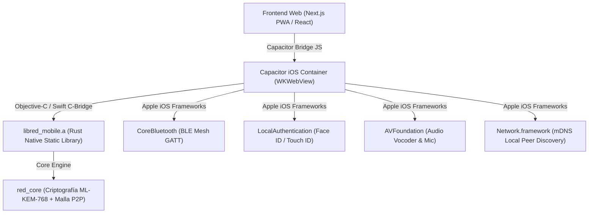

# 🍏 Guía Técnica de Integración y Despliegue en iOS — RED v64.0.0

Este documento detalla la arquitectura de integración, configuración de permisos en `Info.plist`, enlace estático de la biblioteca nativa en Rust (`libred_mobile.a`) y compilación para iOS y iPadOS mediante Capacitor 8 y Xcode 15/16.

---

## 🏗️ 1. Arquitectura de Integración en iOS



---

## 📋 2. Permisos Requeridos en `Info.plist`

Para garantizar el funcionamiento de la red de malla descentralizada, voz y biometría en iOS, `client/app/ios/App/App/Info.plist` debe contener las siguientes declaraciones de privacidad:

```xml
<?xml version="1.0" encoding="UTF-8"?>
<!DOCTYPE plist PUBLIC "-//Apple//DTD PLIST 1.0//EN" "http://www.apple.com/DTDs/PropertyList-1.0.dtd">
<plist version="1.0">
<dict>
    <!-- Bluetooth Mesh (Transmisión y Escaneo continuo) -->
    <key>NSBluetoothAlwaysUsageDescription</key>
    <string>RED utiliza Bluetooth Low Energy para comunicar dispositivos cercanos en modo malla sin conexión a internet.</string>
    <key>NSBluetoothPeripheralUsageDescription</key>
    <string>Permite a este dispositivo actuar como repetidor de malla para otros usuarios en la zona.</string>
    
    <!-- Red Local & Descubrimiento P2P por mDNS -->
    <key>NSLocalNetworkUsageDescription</key>
    <string>RED requiere acceso a la red local para descubrir otros teléfonos conectados al mismo punto de acceso Wi-Fi o router de emergencia.</string>
    <key>NSBonjourServices</key>
    <array>
        <string>_red-mesh._tcp</string>
        <string>_red-mesh._udp</string>
    </array>

    <!-- Biometría Local (Face ID / Touch ID) -->
    <key>NSFaceIDUsageDescription</key>
    <string>Utilizado para desbloquear la bóveda criptográfica y descifrar las claves maestras de identidad.</string>

    <!-- Micrófono para Walkie-Talkie & Malla Acústica -->
    <key>NSMicrophoneUsageDescription</key>
    <string>Permite la transmisión de voz táctica PTT y la modulación acústica ultrasónica en entornos aislados.</string>

    <!-- Cámara para Escaneo de Identidad QR -->
    <key>NSCameraUsageDescription</key>
    <string>Permite escanear códigos QR de identidad para verificar contactos de forma presencial.</string>
</dict>
</plist>
```

---

## 🛠️ 3. Procedimiento de Compilación Local (macOS)

```bash
# 1. Clonar el repositorio
git clone https://github.com/DarckRovert/RED.git
cd RED

# 2. Compilar la biblioteca estática en Rust para iOS
chmod +x ./build_ios.sh
./build_ios.sh

# 3. Compilar los assets del frontend
cd client/app
npm ci
npm run build

# 4. Sincronizar el proyecto Capacitor con Xcode
npx cap sync ios

# 5. Abrir el proyecto en Xcode
npx cap open ios
```

---

## ⚙️ 4. Pipeline Automatizado de CI/CD para iOS (`.github/workflows/build-ios.yml`)

El pipeline se ejecuta automáticamente en cada commit a `main` sobre runners `macos-latest`, ejecutando:
1. `rustup target add aarch64-apple-ios-sim`.
2. Compilación de `libred_mobile.a` mediante `./build_ios.sh`.
3. Sincronización de `out/` con Capacitor.
4. Compilación estricta de `App.app` con `xcodebuild -sdk iphonesimulator`.
5. Publicación del artefacto de compilación para pruebas en simuladores de iPhone 15/16.
