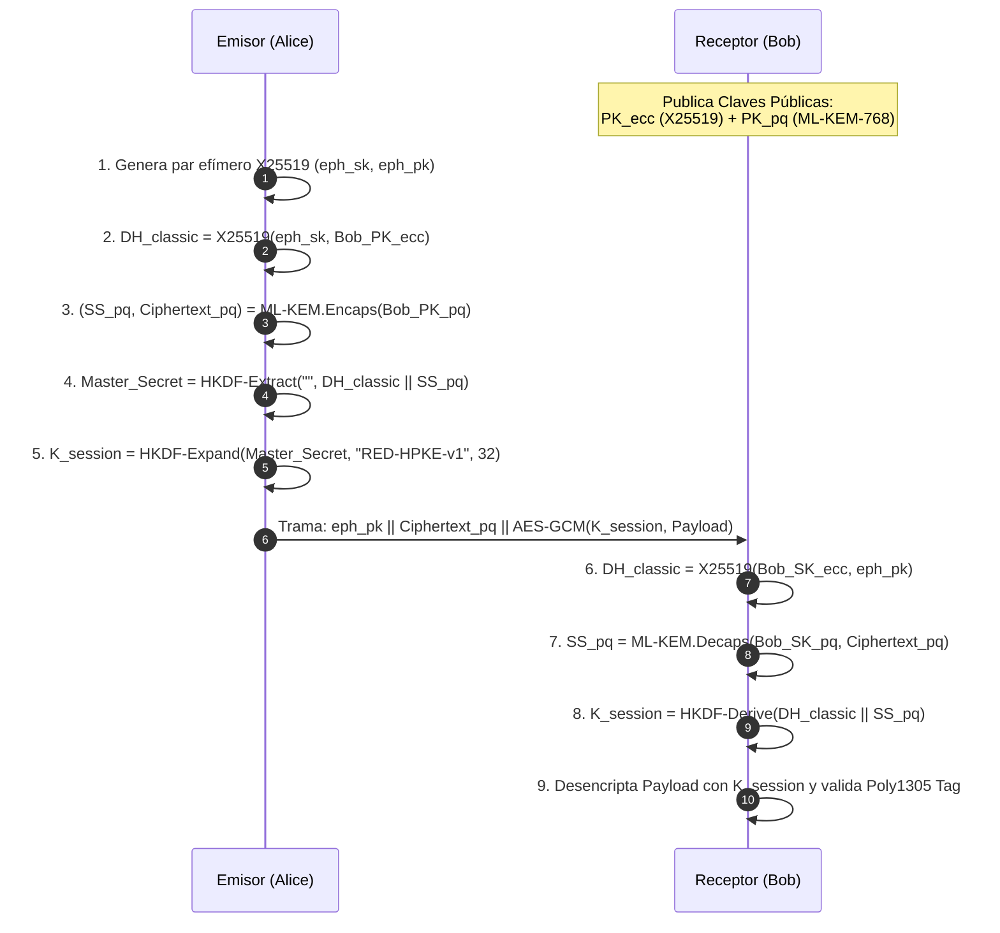

# Especificación Formal de Protocolo — RED v98.0.0

Este documento define la especificación matemática y estructural de tramas de paquetes, acuerdos de clave híbridos post-cuánticos, coordinación espectral LoRa TDMA, enrutamiento geoespacial Geohash y filtros Bloom de deduplicación del ecosistema **RED**.

---

## 1. Estructura Binaria de Tramas (RED Wire Format v2)

Cada trama binaria que transita sobre la red de malla (BLE, Wi-Fi Direct, LoRa, Túnel DNS o Malla Acústica) posee la cabecera canónica de 96 bytes con soporte de indexación espacial:

```
 0                   1                   2                   3
 0 1 2 3 4 5 6 7 8 9 0 1 2 3 4 5 6 7 8 9 0 1 2 3 4 5 6 7 8 9 0 1
+-+-+-+-+-+-+-+-+-+-+-+-+-+-+-+-+-+-+-+-+-+-+-+-+-+-+-+-+-+-+-+-+
|          Magic (0x52454431 = "RED1")          |  Ver  | Flags |
+-+-+-+-+-+-+-+-+-+-+-+-+-+-+-+-+-+-+-+-+-+-+-+-+-+-+-+-+-+-+-+-+
|      TTL      |   Hop Count   |         Payload Length        |
+-+-+-+-+-+-+-+-+-+-+-+-+-+-+-+-+-+-+-+-+-+-+-+-+-+-+-+-+-+-+-+-+
|                                                               |
+                    Message ID (16 bytes)                      +
|                                                               |
+-+-+-+-+-+-+-+-+-+-+-+-+-+-+-+-+-+-+-+-+-+-+-+-+-+-+-+-+-+-+-+-+
|                                                               |
+                 Sender DID Hash (16 bytes)                    +
|                                                               |
+-+-+-+-+-+-+-+-+-+-+-+-+-+-+-+-+-+-+-+-+-+-+-+-+-+-+-+-+-+-+-+-+
|                                                               |
+                Recipient DID Hash (16 bytes)                  +
|                                                               |
+-+-+-+-+-+-+-+-+-+-+-+-+-+-+-+-+-+-+-+-+-+-+-+-+-+-+-+-+-+-+-+-+
|                                                               |
+                 Target Geohash (8 bytes ASCII)                +
+-+-+-+-+-+-+-+-+-+-+-+-+-+-+-+-+-+-+-+-+-+-+-+-+-+-+-+-+-+-+-+-+
|                     Nonce / IV (12 bytes)                     |
|                               +-+-+-+-+-+-+-+-+-+-+-+-+-+-+-+-+
|                               |                               |
+-+-+-+-+-+-+-+-+-+-+-+-+-+-+-+-+                               +
|                  Encrypted Payload (Variable)                 |
|                                                               |
+-+-+-+-+-+-+-+-+-+-+-+-+-+-+-+-+-+-+-+-+-+-+-+-+-+-+-+-+-+-+-+-+
|                   Poly1305 MAC Tag (16 bytes)                 |
+-+-+-+-+-+-+-+-+-+-+-+-+-+-+-+-+-+-+-+-+-+-+-+-+-+-+-+-+-+-+-+-+
```

### Campos de la Cabecera:
- **`Magic` (4 bytes):** Identificador constante `0x52, 0x45, 0x44, 0x31` ("RED1").
- **`Ver` (1 byte):** Versión del protocolo (`0x62` = 98).
- **`Flags` (1 byte):** Bits de control:
  - `Bits 0-3`: Nivel de Prioridad (0 = Bulk, 5 = Normal, 9+ = Emergencia SOS).
  - `Bit 4`: Requiere Acuse de Recibo Criptográfico (`ACK_REQ`).
  - `Bit 5`: Carga útil cifrada con secreto post-cuántico (`PQ_ENC`).
  - `Bits 6-7`: Reservados.
- **`TTL` / `Hop Count` (2 bytes):** Límite de saltos (decremento monótono) y conteo acumulado.
- **`Target Geohash` (8 bytes):** Coordenadas espaciales codificadas en base32 (ej. `6mc5...`) con relleno nulo para poda DTN.

---

## 2. Protocolo de Acuerdo Criptográfico Híbrido (HPKE Post-Cuántica)

Para garantizar secreto perfecto contra computación clásica y cuántica futura, RED combina **ML-KEM-768 (NIST FIPS 203)** y **X25519 (RFC 7748)** mediante HKDF-SHA256:



---

## 3. Coordinación Espectral LoRa TDMA

Para prevenir colisiones por contienda ALOHA cuando coexisten múltiples operadores en una celda de radio:

- **Duración de Supertrama ($T_F$):** $2000 \text{ ms}$.
- **Cantidad de Ranuras ($N$):** $10 \text{ slots}$.
- **Duración de Ranura ($T_S$):** $200 \text{ ms}$.
- **Asignación Determinista (Slots 0 a 7):**
  $$S_{\text{node}} = \text{FNV-1a}(\text{DID}) \pmod 8$$
- **Slot 8 (Baliza & Sincronización):**
  Reservado para anuncios de reloj de red, telemetría de repetidores solares y sincronización de época.
- **Slot 9 (Contienda Dinámica CSMA/CA):**
  Utilizado por nodos transitorios o sin slot fijo, con algoritmo de retroceso binario exponencial:
  $$T_{\text{backoff}} = \text{rand}(10, 50) \times 2^c \text{ ms}$$
- **Bypass de Emergencia SOS (Prioridad $\ge 9$):**
  Los paquetes con bandera SOS suspenden inmediatamente el temporizador de slot y se inyectan a la radio en tiempo cero ($t = 0$).

---

## 4. Enrutamiento Geoespacial Geohash & Poda DTN

Para evitar que el almacenamiento Store-and-Forward colapse con tráfico transcontinental irrelevante:

1. **Codificación:** Todo paquete con geolocalización calcula su código Geohash base32:
   $$\text{Geohash}(\text{lat}, \text{lon}, \text{precision} = 6)$$
2. **Criterio de Aceptación de Portador (`shouldCarrierAcceptPacket`):**
   Una mula de datos móvil con vector de desplazamiento $\vec{V}$ solo acepta custodiar un paquete si:
   $$\text{Prefijo}(P_{\text{geohash}}, 2) = \text{Prefijo}(\vec{V}_{\text{target}}, 2) \quad \land \quad D_{\text{Manhattan}}(P, \text{Actual}) \le R_{\text{max}}$$
3. **Poda Satelital LEO Downlink:**
   Los satélites de órbita baja solo descargan paquetes en ráfaga RF cuando las coordenadas de la huella orbital (*footprint*) coinciden con el prefijo Geohash de longitud 4 del paquete.

---

## 5. Deduplicación por Filtro de Bloom (2048 bits)

Los repetidores solares autónomos ESP32-S3 implementan deduplicación de paquetes en memoria volátil de alta velocidad mediante un filtro de Bloom de 256 bytes (2048 bits):

- **Tamaño del Bitset ($m$):** 2048 bits.
- **Funciones Hash ($k = 2$):**
  $$h_1 = \text{Murmur3}(M_{ID}) \pmod{2048}$$
  $$h_2 = \text{FNV-1a}(M_{ID}) \pmod{2048}$$
- **Tasa de Falsos Positivos:**
  $$P_{\text{error}} \approx \left(1 - e^{-kn/m}\right)^k$$
  Para una ventana de $n = 150$ paquetes únicos recientes, la tasa de falsos positivos es inferior a $1.2\%$, garantizando retención de paquetes sin fugas de memoria en microcontroladores con recursos reducidos.

---

## 6. Difusión Gossipsub y Tolerancia a Fallos

- **Tópico de Transmisión:** `/red/mesh/v1/{module_id}`
- **Fanout por Defecto:** 8 nodos vecinos aleatorios.
- **TTL Máximo de Relevo:** 10 saltos (decremento en cada nodo).
- **Ventana de Deduplicación:** Caché LRU de 10,000 hashes con retención de 300 segundos.
- **Resistencia a Replay:** Hash determinista $ID = \text{BLAKE3}(\text{payload} \parallel \text{nonce} \parallel \text{timestamp})$.

---

## 7. Protocolo de Acuse de Entrega y DTN (Store-and-Forward)

1. Al emitir un mensaje $M$, el emisor lo almacena en `dtnStorage` (IndexedDB v2) con estado `PENDING` e indexación por `targetGeohash`.
2. Al recibir y desencriptar exitosamente $M$, el receptor emite un paquete criptográfico `DELIVERY_ACK` firmado con su clave Ed25519:
   $$\text{ACK} = \text{Ed25519\_Sign}(M_{ID} \parallel \text{Timestamp}, \text{SK}_{\text{Bob}})$$
3. Si no se recibe el ACK dentro de 10 segundos, el emisor ejecuta reintentos exponenciales ($10s, 20s, 40s, 80s, 160s$).
4. Si el enlace está caído (partición de red), el mensaje se retiene en cola DTN con expiración según prioridad (Crítica: 7 días, Normal: 3 días).

---

## 8. Prueba de Trabajo Anti-Flooding (Proof-of-Work Hashcash)

Para evitar ataques de denegación de servicio (DDoS) por inundación en canales de bajo ancho de banda (LoRa/Acústico), cada paquete saliente calcula una prueba de trabajo criptográfica Hashcash:
$$\text{BLAKE3}(M_{ID} \parallel \text{Nonce} \parallel \text{Timestamp}) < 2^{256 - \text{Dificultad}}$$
- **Dificultad Base:** 2 bits (computable en < 1ms en teléfonos de gama baja).
- **Dificultad Adaptativa:** Aumenta dinámicamente hasta 5 bits si la tasa de tráfico local supera los 20 msg/segundo.
