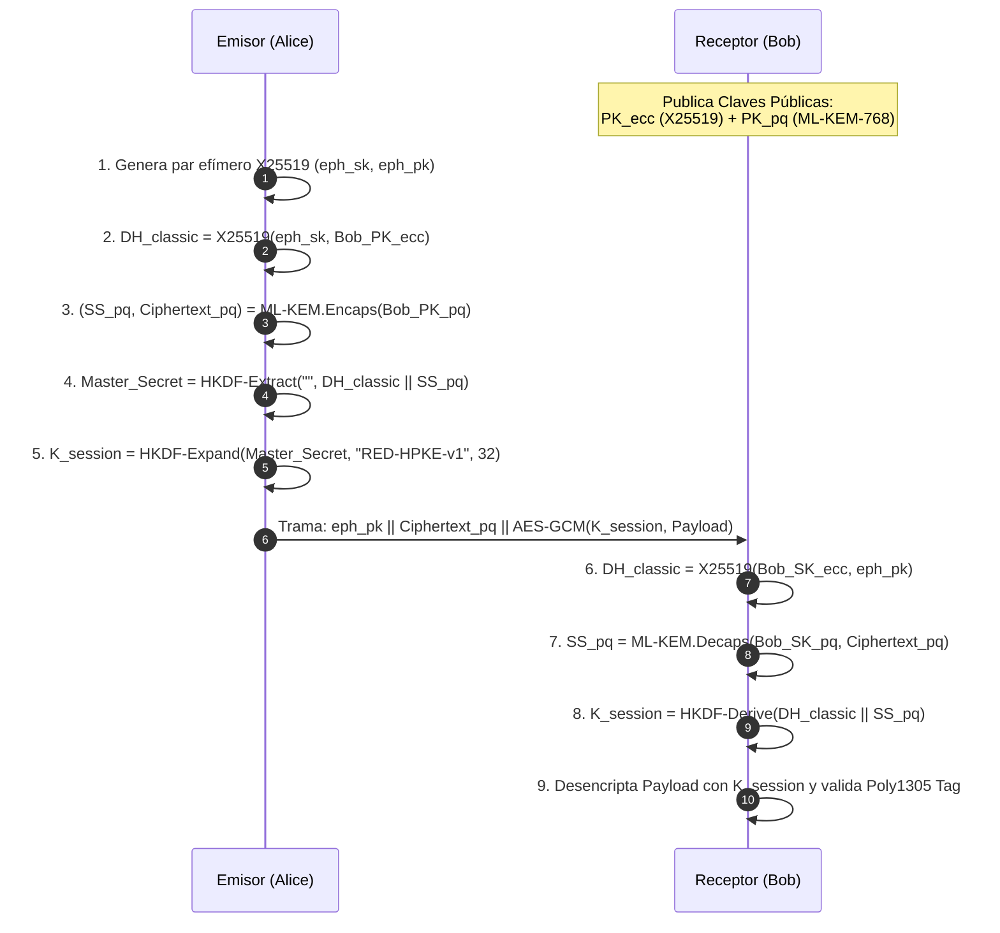

# Especificación Formal de Protocolo — RED v63.0.0

Este documento define la especificación matemática y estructural de tramas de paquetes, acuerdos de clave híbridos post-cuánticos, difusión Gossipsub, topología Kademlia DHT y mecanismos Store-and-Forward (DTN) del ecosistema **RED**.

---

## 1. Estructura Binaria de Tramas (RED Wire Format v1)

Cada trama binaria que transita sobre la red de malla (BLE, Wi-Fi Direct, LoRa, Túnel DNS o Malla Acústica) posee la siguiente cabecera canónica fija:

```
 0                   1                   2                   3
 0 1 2 3 4 5 6 7 8 9 0 1 2 3 4 5 6 7 8 9 0 1 2 3 4 5 6 7 8 9 0 1
+-+-+-+-+-+-+-+-+-+-+-+-+-+-+-+-+-+-+-+-+-+-+-+-+-+-+-+-+-+-+-+-+
|          Magic (0x52454431 = "RED1")          |  Ver  | Flags |
+-+-+-+-+-+-+-+-+-+-+-+-+-+-+-+-+-+-+-+-+-+-+-+-+-+-+-+-+-+-+-+-+
|      TTL      |   Hop Count   |         Payload Length        |
+-+-+-+-+-+-+-+-+-+-+-+-+-+-+-+-+-+-+-+-+-+-+-+-+-+-+-+-+-+-+-+-+
|                                                               |
+                    Message ID (BLAKE3-256)                    +
|                                                               |
+-+-+-+-+-+-+-+-+-+-+-+-+-+-+-+-+-+-+-+-+-+-+-+-+-+-+-+-+-+-+-+-+
|                                                               |
+                 Sender Identity Hash (32 bytes)               +
|                                                               |
+-+-+-+-+-+-+-+-+-+-+-+-+-+-+-+-+-+-+-+-+-+-+-+-+-+-+-+-+-+-+-+-+
|                                                               |
+                Recipient Identity Hash (32 bytes)             +
|                                                               |
+-+-+-+-+-+-+-+-+-+-+-+-+-+-+-+-+-+-+-+-+-+-+-+-+-+-+-+-+-+-+-+-+
|                     Nonce / IV (12 bytes)                     |
|                               +-+-+-+-+-+-+-+-+-+-+-+-+-+-+-+-+
|                               |                               |
+-+-+-+-+-+-+-+-+-+-+-+-+-+-+-+-+                               +
|                  Encrypted Payload (Variable)                 |
|                                                               |
+-+-+-+-+-+-+-+-+-+-+-+-+-+-+-+-+-+-+-+-+-+-+-+-+-+-+-+-+-+-+-+-+
|                   Poly1305 MAC Tag (16 bytes)                 |
+-+-+-+-+-+-+-+-+-+-+-+-+-+-+-+-+-+-+-+-+-+-+-+-+-+-+-+-+-+-+-+-+
```

---

## 2. Protocolo de Acuerdo Criptográfico Híbrido (HPKE Post-Cuántica)

Para garantizar secreto perfecto contra computación clásica y cuántica futura, RED combina **ML-KEM-768 (NIST FIPS 203)** y **X25519 (RFC 7748)** mediante HKDF-SHA256:



---

## 3. Difusión Gossipsub y Tolerancia a Fallos

- **Tópico de Transmisión:** `/red/mesh/v1/{module_id}`
- **Fanout por Defecto:** 8 nodos vecinos aleatorios.
- **TTL Máximo de Relevo:** 10 saltos (decremento en cada nodo).
- **Ventana de Deduplicación:** Caché LRU de 10,000 hashes con retención de 300 segundos.
- **Resistencia a Replay:** Hash determinista $ID = \text{BLAKE3}(\text{payload} \parallel \text{nonce} \parallel \text{timestamp})$.

---

## 4. Protocolo de Acuse de Entrega y DTN (Store-and-Forward)

1. Al emitir un mensaje $M$, el emisor lo almacena en la tabla Sled `dtn_pending` con estado `PENDING`.
2. Al recibir y desencriptar exitosamente $M$, el receptor emite un paquete criptográfico `DELIVERY_ACK` firmado con su clave Ed25519:
   $$\text{ACK} = \text{Ed25519\_Sign}(M_{ID} \parallel \text{Timestamp}, \text{SK}_{\text{Bob}})$$
3. Si no se recibe el ACK dentro de 10 segundos, el emisor ejecuta reintentos exponenciales ($10s, 20s, 40s, 80s, 160s$).
4. Si el enlace está caído (partición de red), el mensaje se retiene en cola DTN con expiración según prioridad (Crítica: 7 días, Normal: 3 días).

---

## 5. Prueba de Trabajo Anti-Flooding (Proof-of-Work Hashcash)

Para evitar ataques de denegación de servicio (DDoS) por inundación en canales de bajo ancho de banda (LoRa/Acústico), cada paquete saliente calcula una prueba de trabajo criptográfica Hashcash:
$$\text{BLAKE3}(M_{ID} \parallel \text{Nonce} \parallel \text{Timestamp}) < 2^{256 - \text{Dificultad}}$$
- **Dificultad Base:** 2 bits (computable en < 1ms en teléfonos de gama baja).
- **Dificultad Adaptativa:** Aumenta dinámicamente hasta 5 bits si la tasa de tráfico local supera los 20 msg/segundo.
